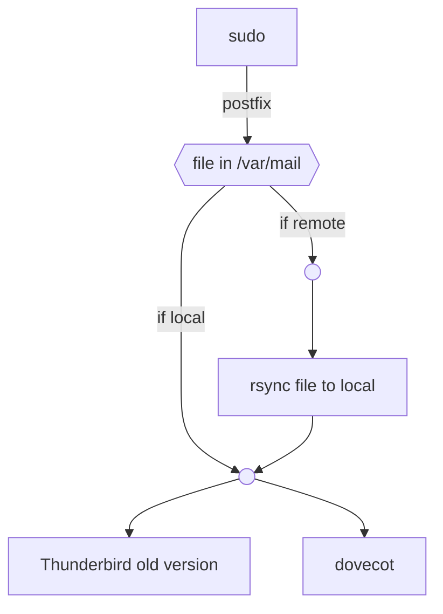

## 目标 Target

当 sudo 检测到异常时, 自动产生记录并提醒管理员; 机器上没有邮件服务器.  
When sudo detects abnormal incidents, auto generate record and notify admin; no mail server on machine.

## 思路 Idea



## 步骤 Steps

### 1. postfix

需要有一个程序来接收 sudo 产生的邮件, 这里选择 postfix.  
There should be some program to receive mail generated by sudo, here we choose postfix.

安装 postfix; 由于没有邮件服务器, 在此方案中配置为本地模式; 其它配置保持默认.  
Install postfix; as there is no mail server, here configure it as local mode; other settings remain default.


### 2. sudo

编辑 `/etc/sudoers.d/mail-sysadmin` 并输入下面的内容, 注意将 admin 替换为你需要的用户.  
Edit `/etc/sudoers.d/mail-sysadmin` and input the following lines, note: replace admin with user you want.

<!-- more -->

```
Defaults      mailto="admin@localhost"
```

用 sudo 触发一些异常事件 (比如不填密码或密码错误) 并查看 /var/mail 来确认配置是否正确.  
Trigger some abnormal incident using sudo (e.g. no password given or wrong password) to verify config is correct.

### 3. Thenderbird + dovecot

若为旧版本 Thunderbird, 应当可通过 movemail 功能直接读取 `/var/mail`.  
For old versions of Thunderbird, should read `/var/mail` directly using movemail-like funciton.

对新版本 Thunderbird, 需要设置 IMAP 服务器, 这里使用 dovecot.  
For new versions of Thunderbird, IMAP server is required, here dovecot is chosen.

安装 dovecot; 为了最小化改动, 用 PAM 鉴权, 即使用机器的账户密码登录 IMAP 服务器; 应当可查看到 `/var/mail` 下本账户的内容.  
Install dovecot; for minimal changes, use PAM auth method, which means use system user name and password to login IMAP server; then should view contents of this user in `/var/mail`.

### 4. 远程服务器 remote server

定时将远程 `/var/mail` 下的文件传回本地, 其余操作一致.  
Transfer remote file in `/var/mail` to local regularly, other steps are same.

例如, 对于需要使用密码保护的密钥访问服务器的情形, 可考虑在本地新建定时任务用来定时下载, 参考命令:  
e.g. for server accessible with password-protected ssh keys only, consider create a cron to download, reference command:

```bash
chmod 644 /home/user/mail/server && SSH_AUTH_SOCK=/run/user/1000/gcr/ssh rsync -axHAXvPz server:/var/mail/admin /home/user/mail/server && chmod -w /home/user/mail/server
```
